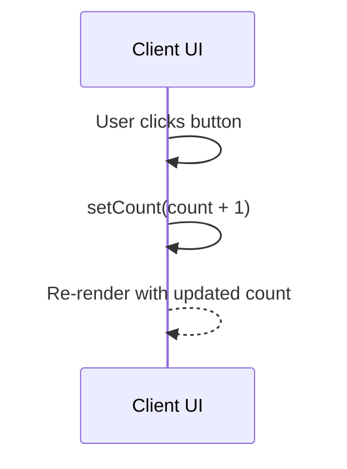

# Counter — Solution Guide

Let’s walk through a clean and practical fix for this warm-up.

## The Big Picture

We want a button whose text displays how many times it has been clicked. The starting code intentionally misses the state import/initialization and includes a broken click handler line.

## Approach Overview

### Layer 1: UI Layer
Purpose: Provide a simple button and show state.  
Analogy: A doorbell that rings louder each time you press it.

There are no data, validation, or API layers for this warm-up.

## Architecture Flow



## Step-by-Step Fix

1. Import `useState` from `react`.
2. Initialize state in the component: `const [count, setCount] = useState(0)`.
3. Update the click handler to increment: `setCount(count + 1)`.

Minimal corrected snippet:

```tsx
import { useState } from 'react';

export default function App() {
  const [count, setCount] = useState(0);
  return (
    <div>
      <button onClick={() => setCount(count + 1)}>
        Clicks: {count}
      </button>
    </div>
  );
}
```

## Testing Your Solution

### Manual Testing

- Load `http://localhost:5173`
- Verify button starts at “Clicks: 0”
- Click repeatedly; verify it increments by 1 each time

### Automated Testing (optional)

```bash
npm run test
```

At a high level, tests would:
- Render `App`
- Click the button N times
- Assert text `Clicks: N`

## Common Pitfalls

- Forgetting to import `useState`
- Setting state outside the component function
- Decrementing instead of incrementing the count
- Breaking the handler with extra syntax

## Security Notes

Not applicable in this warm-up. No data leaves the browser.

## Summary and Next Steps

You fixed a simple React state bug and verified dynamic rendering. Next:
- Add a Reset button
- Persist count in `localStorage`
- Add a unit test with Testing Library


